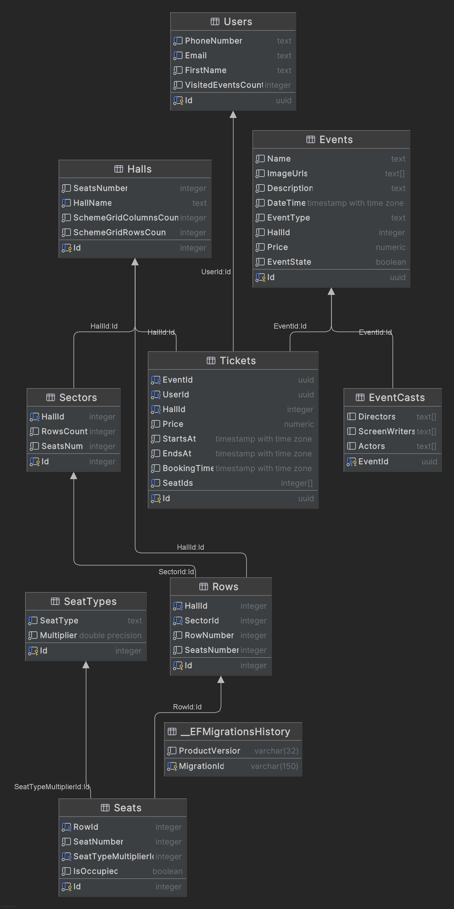
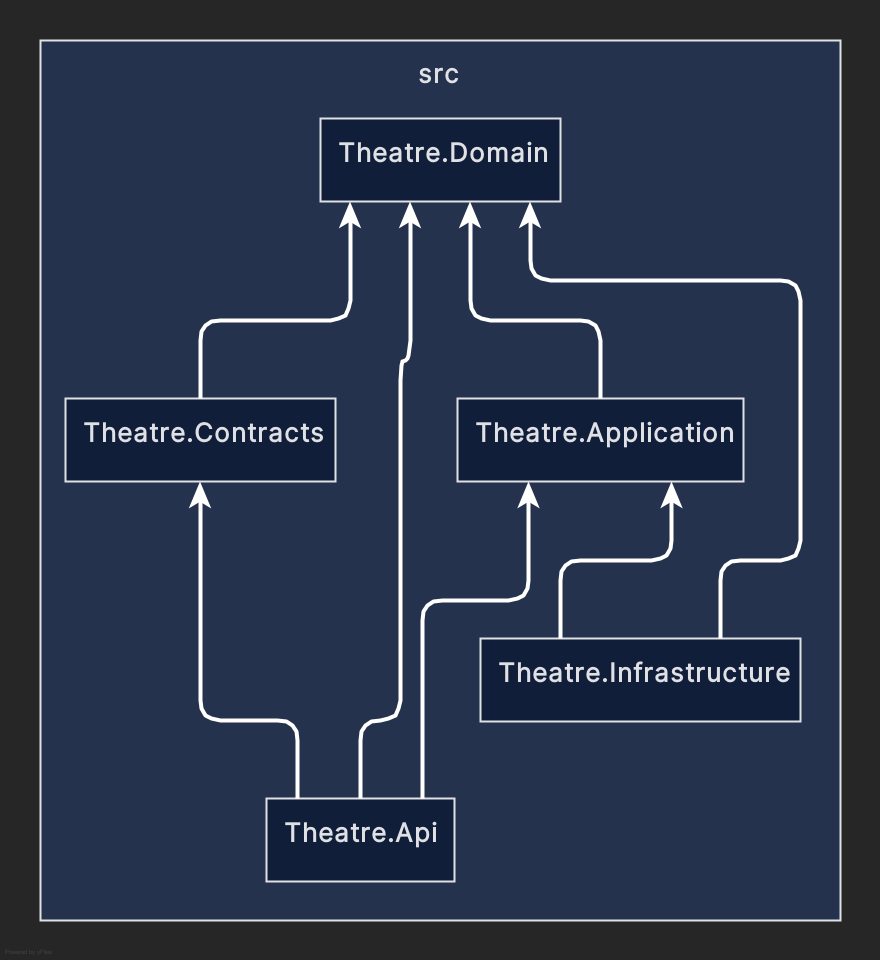

# Theatre

## Overview
This project is a theatre web application built using the Clean Architecture principles, leveraging Angular 17 for the frontend and .NET 8 for the backend. The application is designed to be scalable, maintainable, and future-ready, adhering to the principles of Clean Architecture.

----------

## Technologies Used

    Frontend: Angular 17
    Backend: ASP.NET Core 8
    Database: PostgreSQL
    Util: Twilio for sms verification

### Additional Libraries:

    Entity Framework Core 8
    Mediator
    Twilio SDK (for sms verification)
    FluentValidation

## DB Diagram:

## Project Dependencies Diagram
